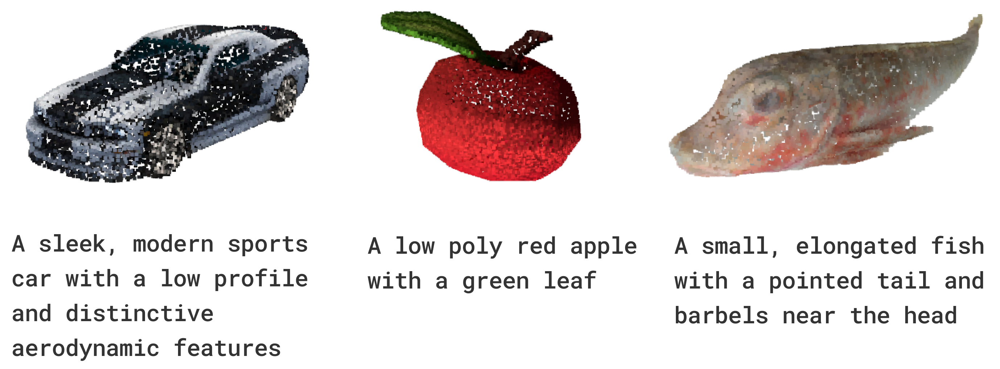

<h1 align="center">Point2Text: Lightweight 3D Point Cloud Captioning via Large Language Model</h1>

<p align="center"></p>
This repo is a project for CSC2503 at the University of Toronto.

## 🏞️ Environment Setup
To set up the environment for training and evaluation, the first step is to install python requirements.
```bash
conda create -n point2text python=3.10.14 -y
conda activate point2text
pip install -r requirements.txt
ln -s /w/20252/<your_username>/CSC2503-Project/data data
ln -s /w/20252/<your_username>/CSC2503-Project/checkpoints checkpoints
```

Download the [ShapeNet dataset](https://mega.nz/file/b5YCQRoa#IvUxxq5UH4UW6ZvjPsQGEprmHzDYaxzdtGdhhupU-60) and the pretrained [PointBERT model](https://huggingface.co/RunsenXu/PointLLM_7B_v1.1_init/resolve/main/point_bert_v1.2.pt?download=true) and place them in the `data/shapenet` and `models/pointbert` directories, respectively.

## 🏭 Training and Evaluation
To train the Point2Text model, run the following command:
```bash
python3 train.py
```
To test the Point2Text model, run the following command:
```bash
python3 test.py
```
To run inference using a trained Point2Text model, run the following command:
```bash
python3 inference.py
```